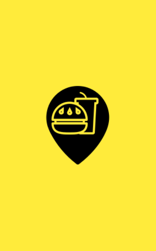
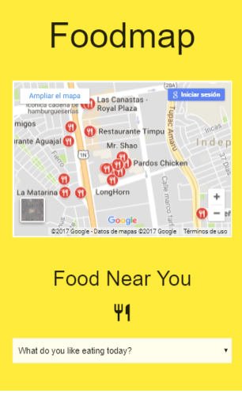

## RETO DE CODIGO F O O D M A P
Track: Common Core.  
Curso: No reinventes la rueda.  
Unidad: Agiliza tu desarrollo.  
## Objetivo
En el siguiente trabajo se realizo una web-app que a través de un input filtra los restaurantes que se encuentran cerca de ti.  

**FLUJO DE LA APLICACIÓN**
- Vista splash con duración de 2 a 5 segundos que redirecciona a la vista principal.
- En la vista principal se muestran todos los restaurantes "cerca de ti" junto con el input  **que le indica al usuario una pregunta personalizada para filtrar su busqueda " ¿que te gustaria comer hoy? *¿What do you like eating today?* " de esa manera el usuario disfruta de la experiencia al usar la web-app, el filtrado de busqueda es por el tipo de comida, o palabras claves como "comida rapida,platos tipicos y delivery".**
- Ya que se hizo la elección del filtro deben mostrarse únicamente aquellos restaurantes que cumplan con la condición.  
- Se agrega un evento mouseover a las imágenes **(muestra el nombre de el restaurante elegido).**   
- Al seleccionar alguno de los restaurantes, se muestra la información de este a través de un modal (**Mapa del lugar, dirección y website**).
- Una vez cerrado el modal vuelve a la vista principal.  

## Herramientas  
- CSS (@Media Queries)
- HTML  
- FRAMEWORK MATERIALIZE  
- JQUERY  

## Producto Final  

**Vista Splash**  
  

**Vista Principal**  

